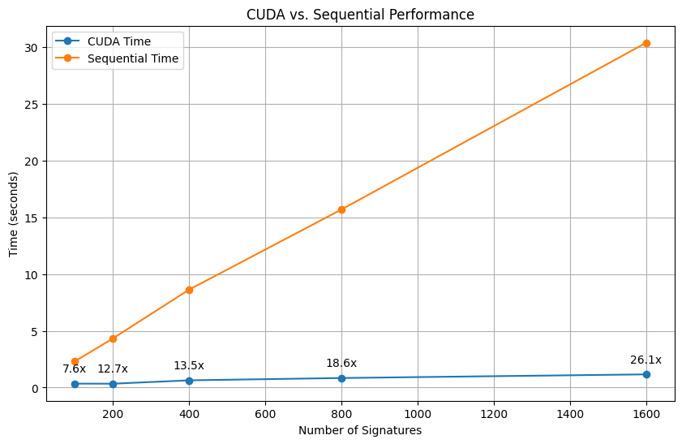
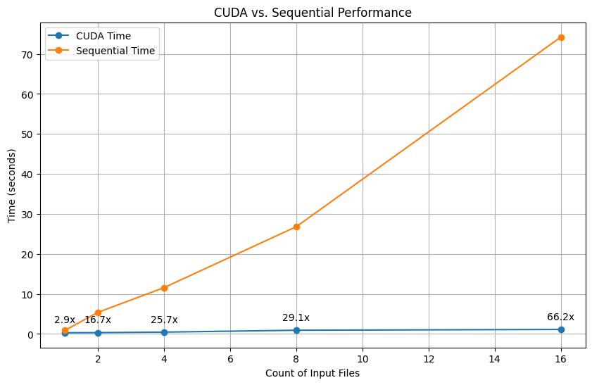

# CS3210 Assignment 2 (CUDA) Report

## 0. Authors:

- Pham Ba Thang (E0550313)
- Nguyen Quy Duc (E0851456)

## 1. Brief description

### 1.1. Program’s parallelisation strategy,

- **Kernel**: We assign one kernel to compare one input file with one virus signature. The kernel is launched multiple times to compare all the input files with all the virus signatures.
- **Thread**: Each thread in a kernel is responsible for comparing the subarray from `idx` to `idx + sig_len` of the input file with the virus signature. The `idx` is the unique thread index calculated as follows:

```cpp
int idx = blockIdx.x * blockDim.x + threadIdx.x
```

`sig_len` is the length of the virus signature after converting to binary:

```cpp
size_t sig_len = len / 2;
```

### 1.2. Grid and block dimensions choice

- **Block Dimensions**: The block size is set to a default value of BLOCK_SIZE = 1024.
- **Grid Dimensions**: We calculate the grid size based on the problem size and the block size using the following formula:

```cpp
// number of comparisons between an input file and a virus signature
size_t n_tasks = (inputs[file_idx].size - (signatures[sig_idx].size)/2 + 1);
// grid size
size_t grid_size = (n_tasks + BLOCK_SIZE - 1) / BLOCK_SIZE;
```

### 3. Block shared memory is not used

Our implementation of `matchFile` does not use block shared memory. Instead, we use a global boolean array `matchArr` to store the results of the comparisons between a file and each virus signature. The `matchArr` is initialized to all `false` values before the kernel is launched. After the kernel is executed, we copy the results from the `matchArr` asynchronously to the CPU memory for further processing.

## 2. Input factors

We conduct benchmarking to determine which factor has the most significant impact on the speedup of our implementation. In the following experiments, we use a files in a contiguous order, meaning if the number of files is 10, we are using the files from `tests/virus-0001` to `tests/virus-0010`. The file sizes are shown in the table below:

| File name  | Size (KB) |
| ---------- | --------- |
| virus-0001 | 119       |
| virus-0002 | 629       |
| virus-0003 | 779       |
| virus-0004 | 350       |
| virus-0005 | 1027      |
| virus-0006 | 49        |
| virus-0007 | 1517      |
| virus-0008 | 60        |
| virus-0009 | 92        |
| virus-0010 | 1900      |
| virus-0011 | 2637      |
| virus-0012 | 1483      |
| virus-0013 | 773       |
| virus-0014 | 27        |
| virus-0015 | 301       |
| virus-0016 | 91        |
| virus-0017 | 1131      |

> All the measures are done on GPU **A100 80GB** with computability of 8.0 and memory of 80GB

### 2.1 Number of virus signatures

We conducted experiments by varying the number of virus signatures while keeping the number of input files fixed at **10**.

| Number of signatures | CUDA time | Sequential time | Speed up |
| -------------------- | --------- | --------------- | -------- |
| 100                  | 347.4ms   | 2.303s          | 7.601x   |
| 200                  | 341.1ms   | 4.328s          | 12.690x  |
| 400                  | 638.9ms   | 8.627s          | 13.502x  |
| 800                  | 843.5ms   | 15.691s         | 18.603x  |
| 1600                 | 1.164s    | 30.389s         | 26.099x  |

> The graph is shown in the [appendix](#graphs)

### 2.2. Number of input files

In the subsequent phase, we maintain a constant number of **2000** signatures while adjusting the count of input files.

| Count of input files | CUDA time | Sequential time | Speed up |
| -------------------- | --------- | --------------- | -------- |
| 1                    | 300.2ms   | 883.8ms         | 2.945x   |
| 2                    | 322.8ms   | 5.395s          | 16.712x  |
| 4                    | 449.9ms   | 11.579s         | 25.735x  |
| 8                    | 921.0ms   | 26.809s         | 29.110x  |
| 16                   | 1.121s    | 74.200s         | 66.190x  |

> The graph is shown in the [appendix](#graphs)

Based on the results of the experiments conducted, it is evident that the most influential factors affecting the speedup of our implementation are the number of virus signatures and the number of input files. The longer the input files and the more the virus signatures, the more significant the speedup is. Since the number of comparison tasks increases exponentially with the number of virus signatures and the length of the input files, we can achieve higher parallelism and thus higher speedup.

## 3. CUDA Implementation

### 3.1. CUDA-based performance optimisation

Initially, we adopted a suboptimal approach where each input file was compared to a single virus signature using multiple threads, but then we synchronized the threads in CPU to ensure that the results were accurate and print them out right after the kernel execution. This approach was inefficient because it forces the CPU to wait for the GPU to finish its each kernel execution before proceeding further, which makes the kernels run sequentially.

Subsequently, we transitioned to a more efficient strategy. Instead of printing out the results right after the kernel execution, we store the `matchArr` of a file in a global boolean array `results` at the corresponding file index. After all the kernels have finished their execution, we synchronize all kernels and iterate through the `results` array to print out the results. This approach allows the kernels to run asynchronously, which significantly improves the performance of our implementation.

`results` is a 2D boolean array where `results[file_idx][sig_idx]` is `true` if the input file at index `file_idx` matches the virus signature at index `sig_idx`.

```cpp
vector<bool*> results;
```

```cpp
// copy the matchArr from GPU to CPU
cudaMemcpyAsync(results[file_idx], dMatchArr, signatures.size() * sizeof(bool), cudaMemcpyDeviceToHost, streams[file_idx]);
```

After the completion of all kernel executions and to ensure synchronization, we utilize the cudaDeviceSynchronize() function to guarantees that all kernels have finished their respective tasks and the results are ready to be processed. After that, we iterate through `results` and print out the results if a match is found.

```cpp
// synchronize all kernels
cudaDeviceSynchronize();

for(size_t file_idx = 0; file_idx < inputs.size(); file_idx++)
{
    for(size_t sig_idx = 0; sig_idx < signatures.size(); sig_idx++)
    {
        if (results[file_idx][sig_idx]) {
            printf("%s: %s\n", inputs[file_idx].name.c_str(), signatures[sig_idx].name.c_str());
        }
    }
    free(results[file_idx]);
}
```

### 3.2. CUDA-based memory optimization

#### Memory coalescing

All the threads in a warp access consecutive memory locations in `file_data`. Therefore, the memory access pattern is like ly to be coalesced into a small number of memory transactions.

#### Minimizing global memory access

The `matchArr` in the kernel is initialized with `false` values, and only the threads that find a match will set the corresponding value to `true`. Therefore, the number of global memory accesses is minimized assuming that the number of matches is small compared to the number of comparisons.

#### Considerations for shared memory

We do not use shared memory in our implementation because each thread accesses a different part of the input file.

We can consider using shared memory for `signature` because all the threads in a block access the same virus signature. However, this can cause bank conflicts because the threads in a warp access consecutive memory locations in `signature`, which complicates the implementation.

## Appendix

### How to run

```bash
sbatch ./a2_slurm_job.sh
```

Change this line if you want to test with other inputs:

```bash
./check.py signatures/sigs-exact.txt tests/virus-0001-Win.Downloader.Banload-242+Win.Trojan.Matrix-8.in
```

### Nodes used for execution

`a100mig` nodes

### Graphs





### References

- CUDA Documentation: https://docs.nvidia.com/cuda/cuda-c-programming-guide/index.html
- GPU Gem 3: https://developer.nvidia.com/gpugems/gpugems3/part-v-physics-simulation/chapter-35-fast-virus-signature-matching-gpu
