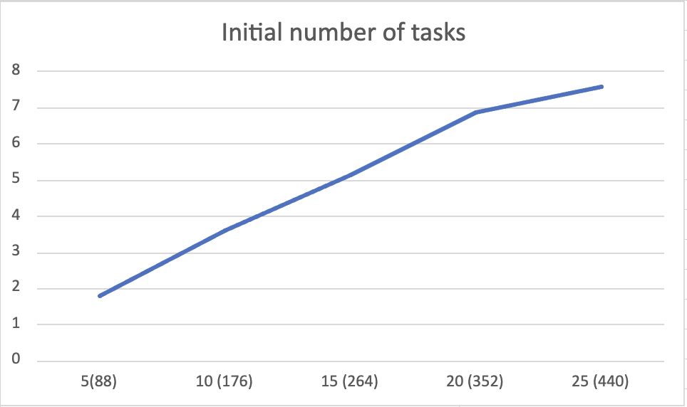
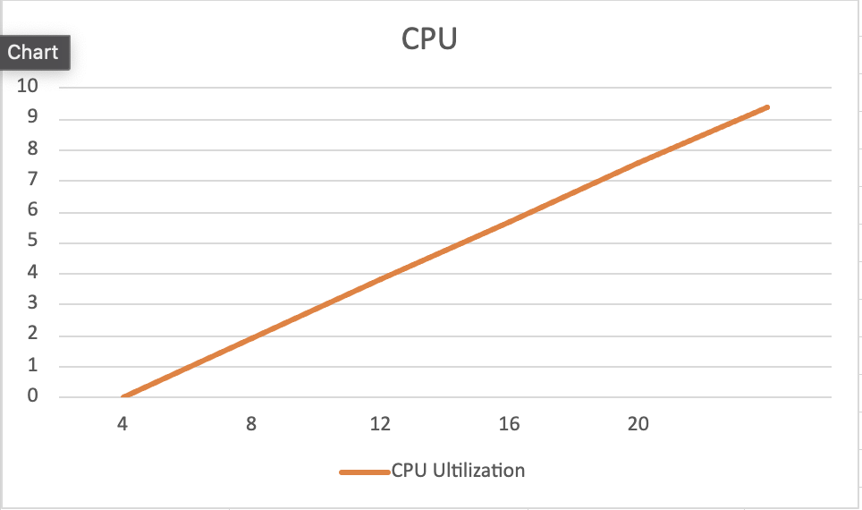

<!-- TODO: DRAW SOME MORE DIAGRAMS FROM DATA -->

# Assignment 3 Report

## 0. Authors

- Nguyen Quy Duc (e0851456)
- Pham Ba Thang (e0550373)

## 1. Implementation Outline

### 1.1. Master-Worker Architecture

The distributed task runner follows a master-worker architecture, where a single master process (rank 0) coordinates the distribution of tasks to other worker processes (other ranks). The master node is responsible for managing a task queue and dividing the tasks to the suitable workers. Worker processes execute assigned tasks and return the results (number of descendant tasks and the descendant tasks) to the master process.

### 1.2. Task Distribution and Communication

The master node maintains:

- a task queue, which contains initial tasks and descendant tasks: `queue<task_t> task_queue = get_initial_tasks(params);`
- a vector to keep track of the availabilities of worker processes: `vector<bool> availability(N_WORKERS, true);`
- a vector containing the MPI request status of non-blocking receive of descendant tasks from each worker process: `vector<MPI_Request> proc_requests(N_WORKERS, MPI_REQUEST_NULL);`
- a vector of received descendant tasks from each worker process: `vector<task_t *> desc_tasks(num_procs - 1, nullptr);`

In each iteration, the master node checks the availability of worker processes:

- If there are processes working (unavailable), the master waits for some of the receiving task commands from those unavailable to complete, then updates the task queue and the worker availability vector accordingly.

```cpp
MPI_Waitsome(unavailable_requests.size(), unavailable_requests.data(), &outcount, indices.data(), MPI_STATUSES_IGNORE);
```

- If there are available workers and tasks in the queue, the master node sends a continuation signal followed by a task to a worker process and marks the worker as unavailable. The master node then non-blockingly receives the descendant tasks from the worker process so that it does not have to wait for worker processes with longer runtimes to complete their tasks.

```cpp
MPI_Irecv(desc_tasks[proc], Nmax, TASK_T_TYPE, worker_rank, 0, MPI_COMM_WORLD, &proc_requests[proc]);
```

- If there are no more tasks in the queue and all workers are available, the master node sends a termination signal to all worker processes. All worker will break the loop and terminate.

The worker nodes receive signals from the master node

- If the worker receives a termination signal, it breaks the loop and terminates.
- Else, if worker receives a continuation signal, it will proceed to receive a task from the master node. The worker executes the task and sends the number of descendant tasks and the descendant tasks to the master node.

### Implementation Considerations

#### Collective Communication vs Point-to-Point Communication

Although collective communication can be more efficient, we decided to use point-to-point communication for the following reasons it is not suitable for our implementation since all workers will have to know the distribution of tasks in advance, which is not possible as the distribution of tasks is dynamically computed by the master node, and the workers do not have information about states of other workers.

#### Blocking vs Non-blocking Communication

We decided to use non-blocking communication for the following reasons:

- The master node can continue to send tasks to other worker nodes without waiting for the current worker node to receive its task.
- The master node can continue to receive descendant tasks from other worker nodes without waiting for the current worker node to complete its task.
- The performace of non-blocking communication is better than blocking communication for our worst case scenario (`tinkywinky.in`)

## 2. Performance Measurement

### 2.1. Measurement Methodology

We decided to test how the program performs with different configurations of the following parameters:

- task depth
- number of initial tasks
- MPI process count
- 2 vs 1 nodes with the same MPI process count

### 2.2. Execution Metrics

#### Task depth

The program is tested with 5 different task depths (4, 8, 12, 16, 20). The number of initial tasks is fixed at 5 (tinkywinky.in). The MPI process count is fixed at 14 (config 1).

The data is shown in [this](#data-task-depth) section in the appendix.

#### Number of Initial Tasks

The program is tested with 5 different number of initial tasks (5, 10, 15, 20, 25). The inital tasks are duplicated 2, 3, 4, and 5 times correspondingly from the tasks in tinkywinky.in. The task depth, Nmin, Nmax, P is fixed at 10, 1, 2, 0.1. The MPI process count is fixed at 20 (config 2).

The data is shown in [this](#data-number-of-initial-tasks) section in the appendix.

#### MPI Process Count

The program is tested with 5 different MPI process counts (4, 8, 12, 16, 20) on the same node xs-4114. The task depth, number of initial tasks, Nmin, Nmax, P are fixed at 10, 10, 1, 2, 0.1.

The data is shown in [this](#data-mpi-process-count) section in the appendix.

#### 2 vs 1 partitions

The last test is conducted to see if there is any difference in performance between running the program on 2 and 1 partition with the same MPI process count. The task depth, number of initial tasks, Nmin, Nmax, P are fixed at 10, 20, 1, 2, 0.1. The MPI process count will be tested at 8 and 12 (all on xs-4114 or half on xs-4114 and other half on i7-7700).

The comparison data is shown in [this](#data-2-vs-1-partitions) section in the appendix.

### 2.3. Analysis of results

#### Task depth

As the task depth increases, the number of tasks increases as well. For smaller task depths, the speed up is not significant as there are communication overhead and the number of tasks is not large enough to fully utilize the parallelism of the program. For larger task depths, the speed up is more significant as the number of tasks is large enough to fully utilize the parallelism of the program.

#### Number of initial tasks

These results above are quite consistent with what we have expected for the output of our implementation. For smaller number of initial tasks, this leads to the size of the task pool to be smaller at first. As a result, only a few workers will be working on executing a task in one iteration and the other processes will be idle in the meantime. But for larger task pool (25 tasks compared to 19 workers), all the workers will be working on executing a task in one iteration, taking full advantage of parallelism.

#### MPI process count

We notice a limit of speed up when the number of process is larger than the actual number of tasks in the task pool. As mentioned previously, if the number of tasks is smaller than the number of processes, there are some processes staying idle throughout the whole run as the number of descendant tasks is either 1 or 2. This explains why the runtime is actually slower when we have 20 processes compared to 12 processes because of the overhead of communication between processes.

#### 2 vs 1 partitions

We can see that the runtime on i7-7700 partition is faster than the runtime on xs-4114 partition. This is because the i7-7700 partition has a higher clock speed (3.6 GHz vs 2.2 GHz). However, the speed up is not significant as the communication overhead is still the same.

## 3. Modifications attempted

For each modification, we measured the runtime of the program before and after the modification. We decided to use the config 1 tests as mentioned in the assignment description to measure the runtime of the program.

```
sbatch config1.sh 16 1 2 0.10 tests/tinkywinky.in
sbatch config1.sh 5 3 5 0.50 tests/dipsy.in
sbatch config1.sh 5 2 2 0.00 tests/lala.in
sbatch config1.sh 5 2 4 0.50 tests/po.in
sbatch config1.sh 12 0 10 0.16 tests/thesun.in
```

### 3.1. Change from Scatter-Gather to Master-Worker

At first, we used Scatter and Gather to distribute tasks to worker processes and collect results from them in each iteration in a synchonized manner.

```

MPI_Scatterv(task_queue.data(), send_counts.data(), displs.data(), task_t_type, local_tasks.data(), send_counts[rank], task_t_type, 0, MPI_COMM_WORLD);

MPI_Gatherv(new_tasks.data(), num_new_tasks, task_t_type, task_queue.data(), new_task_counts.data(), new_task_displs.data(), task_t_type, 0, MPI_COMM_WORLD);

```

This method facilitates the usage of collective communication, which is more efficient. However, we found that this is not optimized for the task distribution as each tasks has a different run time and the master node has to wait for the slowest worker to complete its task before proceeding to the next iteration. Therefore, we changed to out master-worker implementation to distribute tasks and collect results from worker processes asynchronously.

The comparison data is shown in [this](#data-scatter-gather-vs-master-worker) section in the appendix.

### 3.2. Change from Blocking to Non-blocking sends

We changed from blocking to non-blocking communication to reduce the waiting time of the master node for the worker nodes to receive their tasks. The master node can continue to send tasks to other worker nodes without waiting for the current worker node to receive its task.

The comparison data is shown in [this](#data-blocking-vs-non-blocking-sends) section in the appendix.

### 3.3. Always send the vector with Nmax size

Instead of sending the number of descendant tasks followed by the task, we always send the vector with Nmax size. The master then go through the vector and add the available tasks to the task queue. The rationale for this is:

- This modification is to cut down 1 communication step between the master node and each worker node when sending back the descendant tasks to the master node.
- Since for all graded test inputs, we can see that Nmax is relatively small (less than 10), the overhead of sending the vector with Nmax size is not significant.

## Appendix

### Performance Measurement Data

#### Data: Task depth

| Task depth - Total #tasks | Sequential runtime (ms) | MPI runtime (ms) | Speed up (times) | CPU Utilization (CPUs) |
| ------------------------- | ----------------------- | ---------------- | ---------------- | ---------------------- |
| 4 - 30                    | 7002                    | 4342             | 1.612            | 8.816                  |
| 8 - 66                    | 14890                   | 7315             | 2.035            | 9.313                  |
| 12 - 115                  | 21612                   | 11901            | 1.815            | 9.501                  |
| 16 - 175                  | 44167                   | 14951            | 2.954            | 9.636                  |
| 20 - 305                  | 70305                   | 18998            | 3.700            | 9.682                  |


#### Data: Number of initial tasks

| Number of initial tasks - Total #tasks | Sequential runtime (ms) | MPI runtime (ms) | Speed up (times) | CPU Utilization (CPUs) |
| -------------------------------------- | ----------------------- | ---------------- | ---------------- | ---------------------- |
| 5 - 88                                 | 20270                   | 11363            | 1.783            | 9.457                  |
| 10 - 176                               | 40540                   | 11232            | 3.606            | 9.493                  |
| 15 - 264                               | 60643                   | 11829            | 5.126            | 9.474                  |
| 20 - 352                               | 80870                   | 11740            | 6.888            | 9.412                  |
| 25 - 440                               | 101135                  | 13346            | 7.577            | 9.497                  |




#### Data: MPI process count

| MPI process count | Sequential runtime(ms) | MPI runtime(ms) | Speed up            | CPU Utilization (CPUs) |
| ----------------- | ---------------------- | --------------- | ------------------- | ---------------------- |
| 4                 | 40504                  | 22282           | 1.8177901445112647x | 1.943                  |
| 8                 | 40540                  | 12124           | 3.3408116133289343x | 3.815                  |
| 12                | 40540                  | 11220           | 3.609982174688057x  | 5.687                  |
| 16                | 40540                  | 10993           | 3.6845265168743744x | 7.588                  |
| 20                | 40540                  | 11732           | 3.452437777020116x  | 9.41                   |




#### Data: 2 vs 1 partitions

All data are for 8 MPI processes.

| Partition         | MPI runtime (ms) | Speed up (times) | CPU Utilization (CPUs) |
| ----------------- | ---------------- | ---------------- | ---------------------- |
| xs-4114 + i7-7700 | 11406            | 3.548            | 3.81                   |
| xs-4114\*2        | 12298            | 3.291            | 3.82                   |
| i7-7700\*2        | 8390             | 4.824            | 3.821                  |


#### Data: Scatter-Gather vs Master-Worker

| Test case                                         | Runtime(ms) - Scatter-Gather | Runtime(ms) - Master-Worker |
| ------------------------------------------------- | ---------------------------- | --------------------------- |
| sbatch config1.sh 16 1 2 0.10 tests/tinkywinky.in | 34908                        | 14963                       |
| sbatch config1.sh 5 3 5 0.50 tests/dipsy.in       | 28828                        | 20344                       |
| sbatch config1.sh 5 2 2 0.00 tests/lala.in        | 19588                        | 9253                        |
| sbatch config1.sh 5 2 4 0.50 tests/po.in          | 29182                        | 13547                       |
| sbatch config1.sh 12 0 10 0.16 tests/thesun.in    | 75734                        | 33416                       |


#### Data: Blocking vs Non-blocking sends

| Test case                                         | Runtime(s) - Blocking | Runtime(s) - Non-blocking |
| ------------------------------------------------- | --------------------- | ------------------------- |
| sbatch config1.sh 16 1 2 0.10 tests/tinkywinky.in | 16372                 | 14963                     |
| sbatch config1.sh 5 3 5 0.50 tests/dipsy.in       | 21152                 | 20344                     |
| sbatch config1.sh 5 2 2 0.00 tests/lala.in        | 9310                  | 9253                      |
| sbatch config1.sh 5 2 4 0.50 tests/po.in          | 13795                 | 13547                     |
| sbatch config1.sh 12 0 10 0.16 tests/thesun.in    | 33902                 | 33416                     |


#### Excel file for all data

The data can also be found in this [Excel file](doc/assignment3.xlsx)
